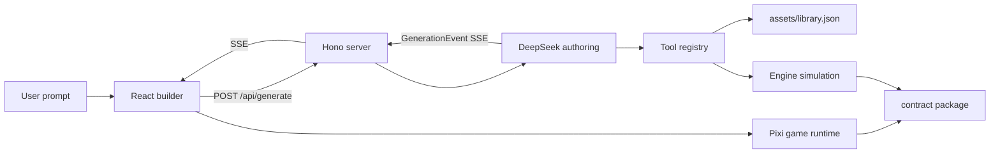

# candylovable

candylovable is a prompt-to-playable match-3 builder. A user describes a Candy Crush-style game, the DeepSeek authoring pipeline turns the prompt into a typed `GameDefinition`, and the browser renders a live Pixi-powered board with real asset packs, match/cascade gameplay, juice, version history, and editable game entities.

The repo is a TypeScript pnpm workspace. It keeps the game contract, engine, authoring layer, backend, frontend, runtime renderer, and mocks in separate packages so each seam is testable.

## What it does

- **Prompt-to-game generation** — `/api/generate` streams a game build over SSE.
- **DeepSeek tool orchestration** — the authoring layer uses a fixed tool registry to select themes, set rules, author levels, validate assets, simulate solvability, tune juice, and finalize a game.
- **Human-readable generation stream** — even when DeepSeek only emits tool calls, the backend streams assistant narration such as “I’m choosing the candy theme” and “I’m designing level 1.”
- **Live match-3 preview** — the frontend mounts a real Pixi scene and drives swaps, clears, gravity, refill, score, win/loss banners, particles, shake, and squash/stretch.
- **Typed engine boundary** — `@candylovable/contract` owns `GameDefinition`, `EngineEvent`, `EngineInstance`, SSE events, and `CONTRACT_VERSION`.
- **Asset-grounded visuals** — `assets/library.json` and `assets/asset-skill.md` are the model’s source of truth for tile art, backgrounds, shared effects, and blockers.
- **Version history** — generated games are persisted by the backend store and surfaced in the builder UI.
- **Mock-friendly development** — the app runs without a DeepSeek key by using the fake authoring adapter and MSW-backed frontend flows.

## Architecture



### Workspace packages

| Path | Package | Responsibility |
| --- | --- | --- |
| `app/` | `@candylovable/app` | React builder UI, SSE client, chat/generation timeline, live preview, author panel, version history. |
| `packages/server/` | `@candylovable/server` | Hono API, SSE streaming, asset serving, project/session store, real/fake authoring bridge. |
| `packages/authoring/` | `@candylovable/authoring` | DeepSeek client boundary, prompt assembly, tool registry, generation loop, validation, cost logging. |
| `packages/engine/` | `@candylovable/engine` | Headless match-3 engine and analysis/simulation helpers. |
| `packages/contract/` | `@candylovable/contract` | Shared types and event contracts used by frontend, backend, runtime, and engine. |
| `packages/mocks/` | `@candylovable/mocks` | Deterministic fake engine, sample game definitions, MSW fixtures, and test helpers. |
| `game-runtime/` | `@candylovable/game-runtime` | Layout math, juice mapping, board controller, tween engine, and browser-only Pixi scene. |
| `assets/` | — | Asset library, theme images, shared effects, and model-facing asset instructions. |

## Runtime flow

1. The frontend posts a prompt to `/api/generate`.
2. The server opens a session and streams `GenerationEvent` frames.
3. The authoring loop calls DeepSeek v4 with a cache-stable system/tools prefix.
4. DeepSeek emits tool calls. The backend executes tools locally and streams assistant narration before each tool.
5. Tools build a draft `GameDefinition`, validate asset refs, simulate levels, tune juice, and call `finalize`.
6. The server persists the final game and returns it as `gameReady`.
7. The React app commits the game to its project history and mounts it in the Pixi preview.
8. Gameplay uses the shared contract: the engine emits semantic events, and `BoardController` converts them into scene operations.

## Requirements

- Node.js 22+
- pnpm 9.15.1+
- A DeepSeek API key only when running real authoring

## Setup

```bash
pnpm install
cp .env.example .env
```

Local development works without credentials. If `DEEPSEEK_API_KEY` is empty, the backend falls back to fake authoring.

To enable real DeepSeek generation, set:

```bash
DEEPSEEK_API_KEY=...
```

Optional `.env` values:

```bash
DEEPSEEK_BASE_URL=https://api.deepseek.com
PORT=8787
ASSET_ROOT=./assets
DATA_FILE=./packages/server/.data/store.json
BACKEND_URL=http://localhost:8787
```

## Development

Run the full stack with the real backend:

```bash
pnpm dev
```

This starts:

- backend: `@candylovable/server` on `PORT` or `8787`
- frontend: `@candylovable/app` on Vite port `5180`

Run the frontend-only mock flow:

```bash
pnpm dev:mock
```

Run the server directly:

```bash
pnpm --filter @candylovable/server dev
```

Run the app directly:

```bash
pnpm --filter @candylovable/app dev
```

## API surface

| Method | Path | Purpose |
| --- | --- | --- |
| `GET` | `/api/health` | Returns health and contract version. |
| `GET` | `/api/library` | Returns the raw asset library. |
| `GET` | `/api/themes` | Lists resolved themes. |
| `GET` | `/api/themes/:id` | Returns one theme. |
| `POST` | `/api/validate` | Validates a `GameDefinition` with the engine analyzer. |
| `POST` | `/api/generate` | Streams a generated game over SSE. |
| `POST` | `/api/iterate` | Placeholder route for targeted iteration; real iteration is pending. |
| `GET` | `/api/projects` | Lists persisted projects. |
| `GET` | `/api/projects/:id` | Returns one project. |
| `GET` | `/api/projects/:id/versions` | Lists versions for a project. |
| `GET` | `/api/projects/:id/versions/:n` | Returns a version. |
| `POST` | `/api/projects/:id/restore/:n` | Restores a version by creating a new current version. |
| `GET` | `/assets/*` | Serves static theme/shared assets with path traversal protection. |
| `GET` | `/api/cost` | Returns cumulative DeepSeek spend when real authoring is enabled. |

## Generation events

The app consumes `GenerationEvent` SSE frames through `fetch` and `ReadableStream` rather than `EventSource`, because the stream needs abort support and can later carry auth headers.

Important event types:

- `plan` — advisory generation plan.
- `token` — assistant narration or model prose shown in the chat timeline.
- `step` — completed tool step with a human-readable label.
- `partial` — partial `GameDefinition` preview data.
- `gameReady` — finalized playable game.
- `error` — recoverable or terminal pipeline error.
- `done` — stream completion.

## Testing

Run all Vitest projects:

```bash
pnpm test
```

Run typechecks across the workspace:

```bash
pnpm typecheck
```

Run the build checks:

```bash
pnpm build
```

Run browser E2E for the Pixi/WebGL path:

```bash
pnpm --filter @candylovable/app test:e2e
```

Useful focused tests:

```bash
pnpm vitest run packages/authoring/src/orchestrator/generate.test.ts
pnpm vitest run game-runtime/src/__tests__/board-controller.test.ts game-runtime/src/__tests__/tween.test.ts
pnpm vitest run app/src/features/generation/ActionTimeline.test.tsx app/src/features/generation/reducer.test.ts
```

Live DeepSeek tests are opt-in:

```bash
DEEPSEEK_LIVE=1 pnpm exec vitest run packages/authoring/src/llm/live.test.ts
DEEPSEEK_LIVE=1 pnpm exec vitest run packages/authoring/src/orchestrator/live-flash-vs-pro.test.ts
```

## Assets

The asset catalog is a contract, not a loose folder convention.

- `assets/library.json` lists themes, backgrounds, tiles, overlays, blockers, 9-slice textures, and particles.
- Tile art is keyed by `colorId` and consumed by the engine, frontend, and DeepSeek tools.
- `assets/asset-skill.md` is injected into the DeepSeek prompt so the model uses existing assets instead of inventing file paths.
- The backend serves assets from `ASSET_ROOT` through `/assets/*` and rejects path traversal.

## Gameplay runtime notes

The runtime separates logic from rendering:

- The engine owns board state, legal moves, match detection, gravity, refill, score, and end states.
- `BoardController` mirrors engine events into a renderer-agnostic `Scene` interface.
- `PixiScene` draws and animates tiles in the browser.
- `Tweener` owns frame-driven interpolation and cancels stale property tweens so cascades cannot leave visual holes.

This split keeps cascade behavior unit-testable without WebGL and keeps the browser path covered by Playwright.

## Troubleshooting

### The app generates fake games

`DEEPSEEK_API_KEY` is missing. Add it to `.env`, then restart the backend.

### Frontend calls fail with 404 or connection errors

Make sure the backend is running on `BACKEND_URL` or the default `http://localhost:8787`. The Vite dev server proxies `/api/*` and `/assets/*` to that backend.

### Pixi preview does not mount

Run the browser E2E test first:

```bash
pnpm --filter @candylovable/app test:e2e
```

If it passes, the issue is likely a local browser/GPU extension or stale dev server. Restart the Vite server and reload.

### DeepSeek cost badge stays at zero

The `/api/cost` endpoint exists only when real authoring is enabled. Set `DEEPSEEK_API_KEY` and restart the server.

### Generated art references are missing

Check `assets/library.json` and `assets/asset-skill.md`. The authoring tools validate asset references; missing assets should fail validation instead of silently rendering broken paths.

## Current limitations

- Real targeted iteration is not implemented yet; `/api/iterate` returns a clear error until the DeepSeek P4 edit pipeline lands.
- Runtime goals are constrained to engine-supported score and collect goals in real authoring.
- Advanced blockers and bring-down goals are reserved for a future contract version.

## License

[MIT](./LICENSE)
